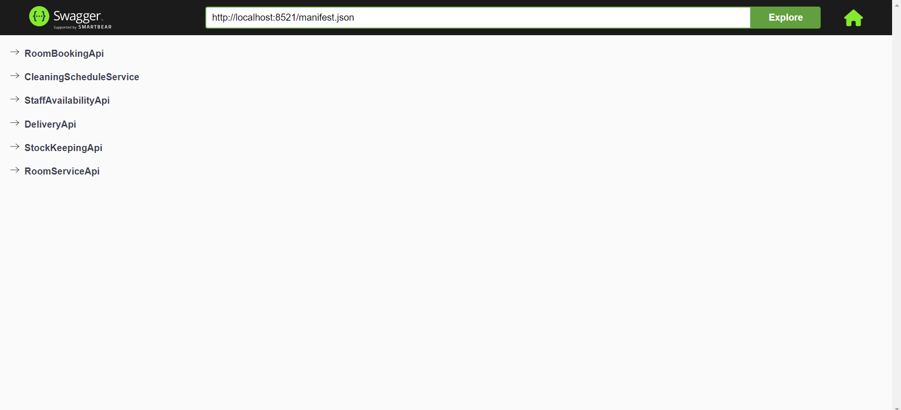
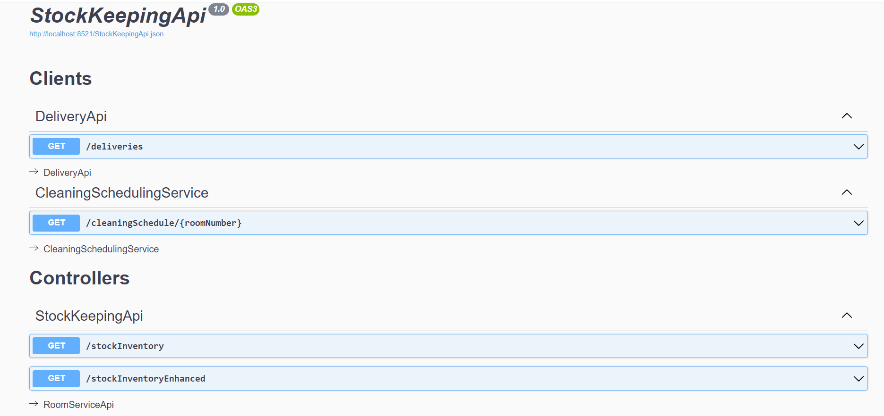

# 

***PLEASE NOTE, THIS PACKAGE IS STILL IN DEVELOPMENT***

## Introduction
Multi-Swagger is a script that allows you to link swagger specifications for services that call each other and navigate between them. 

It's a fork of the [swagger-ui](https://github.com/swagger-api/swagger-ui) repository. Please see the swagger-ui package for more extensive documentation.

## Getting Started

In order to run multi-swagger, you need to create a json file like below called `manifest.json`, consisting of a list of services. Then, in the same directory, you need to run `npm run multi-swagger` or `npx multi-swagger`.

Each service has a name, url of the swagger file and a list of clients. The list of clients consists of a list of service
names that call into that service. E.g. In the file below, RoomBookingApi and Delivery Api both call into the StockKeeping Api

```javascript
{
  "Services": [
    {
      "Name": "RoomBookingApi",
      "ExposedEndpoints": "/roomBookingApi.json"

    },
    {
      "Name": "StaffAvailabilityApi",
      "ExposedEndpoints": "/staffAvailabilityApi.json"

    },
    {
      "Name": "DeliveryApi",
      "ExposedEndpoints": "/deliveryApi.json"
    },
    {
      "Name": "DeliveryApi",
      "ExposedEndpoints": "/cleaningScheduleService.json"
    },
    {
      "Name": "StockKeepingApi",
      "ExposedEndpoints": "/stockKeepingApi.json",
      "Clients": [
        "StockKeepingApi/Clients/deliveryApi.json",
        "CleaningScheduleService/cleaningScheduleService.json"
      ]
    },
    {
      "Name": "RoomServiceApi",
      "ExposedEndpoints": "/roomServiceApi.json",
      "Clients": [
        "RoomServiceApi/Clients/roomBookings.json",
        "RoomServiceApi/Clients/stockKeeping.json"
      ]
    }
  ]
}
```

## How it works

Multi-Swagger will recreate the files used in a temporary directory in the temp folder. It will then run a http-server on port 8521, and the swagger-ui React app on port 3200.

The homepage with links to the different services:



The service swagger page with links to clients and services of which this is a client

